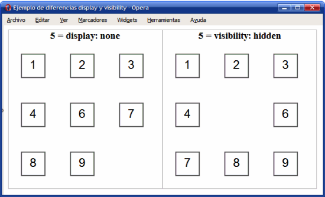
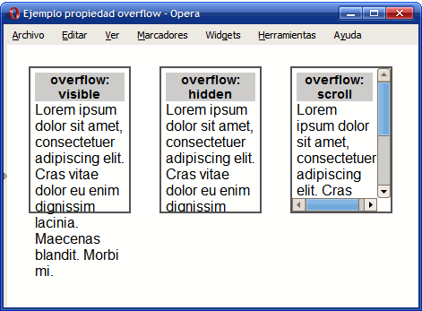
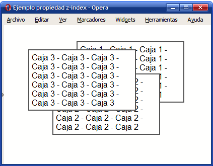
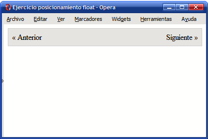
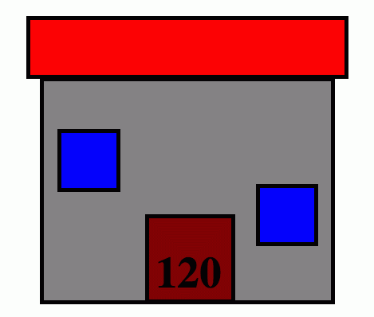

### Ejercicio 10: css. Posicionamiento y visualización.

####Resumen

Tipos de posicionamiento:

* Posicionamiento normal o estático: se trata del posicionamiento que utilizan los navegadores si no se indica lo contrario.
* [Posicionamiento relativo](ejemplo_relativo.html): variante del posicionamiento normal que consiste en posicionar una caja según el posicionamiento normal y después desplazarla respecto de su posición original.
* [Posicionamiento absoluto](ejemplo_absoluto.html): la posición de una caja se establece de forma absoluta respecto de su elemento contenedor y el resto de elementos de la página ignoran la nueva posición del elemento.
* [Posicionamiento fijo](ejemplo_fijo.html): variante del posicionamiento absoluto que convierte una caja en un elemento inamovible, de forma que su posición en la pantalla siempre es la misma independientemente del resto de elementos e independientemente de si el usuario sube o baja la página en la ventana del navegador.
* [Posicionamiento flotante](ejemplo_flotante.html): se trata del modelo más especial de posicionamiento, ya que desplaza las cajas todo lo posible hacia la izquierda o hacia la derecha de la línea en la que se encuentran.

	Etiquetas: 
   	* *position*; valores: static, relative, absolute, fixed
   	* top, right, bottom, left

Visualización: 
	* La propiedad *display* permite ocultar completamente un elemento haciendo que desaparezca de la página.
	* La propiedad visibility permite hacer invisible un elemento, lo que significa que el navegador crea la caja del elemento pero no la muestra.
	
	* CSS define la propiedad overflow para controlar la forma en la que se visualizan los contenidos que sobresalen de sus elementos.
	
	* La posición tridimensional de un elemento se establece sobre un tercer eje llamado Z y se controla mediante la propiedad z-index.
	

#### Ejercicios

1. A partir del código HTML proporcionado:

		<!DOCTYPE html PUBLIC "-//W3C//DTD XHTML 1.0 Transitional//EN" "http://www.w3.org/TR/xhtml1/DTD/xhtml1-transitional.dtd">
		<html xmlns="http://www.w3.org/1999/xhtml">
		<head>
		  <meta http-equiv="Content-Type" content="text/html; charset=iso-8859-1" />
		  <title>Ejercicio posicionamiento float</title>
		  
		</head>
		 
		<body>
		  

		    &laquo; Anterior &nbsp; Siguiente &raquo;
		  

		</body>
		</html>

	Determinar las reglas CSS necesarias para que el resultado sea similar al mostrado en la siguiente imagen:

	

2. Dibujando una casa con CSS: Analizar y comprender [el fichero HTML que se adjunta](ej/casa.html). Todos los divs están posicionados de forma absoluta y constan de un borde negro de 3px, además de un padding de 5 px.

	* ¿Cuál será el tamaño del div 'casa'?
	* Alinear el tejado con la casa, haciendo que coincidan el borde inferior del tejado con el borde superior de la casa. Para ello, deberá alterarse el estilo del div 'tejado'.
	* El tejado deberá estar centrado en la casa. Para ello deberá alterarse el estilo del div 'tejado'.
	* Definir una puerta de 50px de alto y 50px de ancho de color marrón y que quede centrada en la casa.
	* Definir 1 'ventana' para cada una de las 2 plantas de la casa (30px x 30px).

	El código HTML definitivo sería el siguiente:

		

		   

		   
<h1>120</h1>

		   

		   

		

	El resultado final debería ser parecido al siguiente:

	