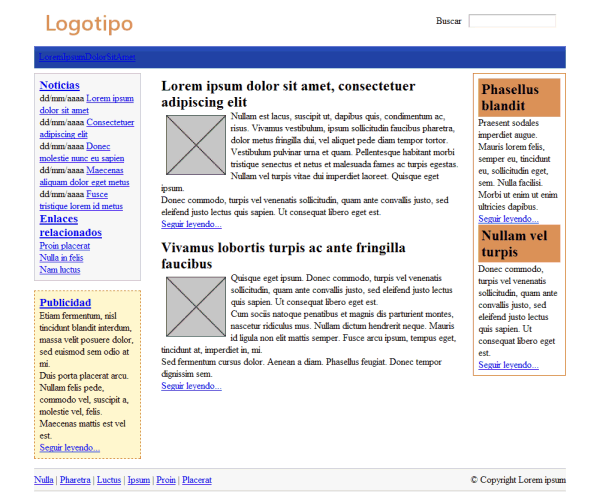
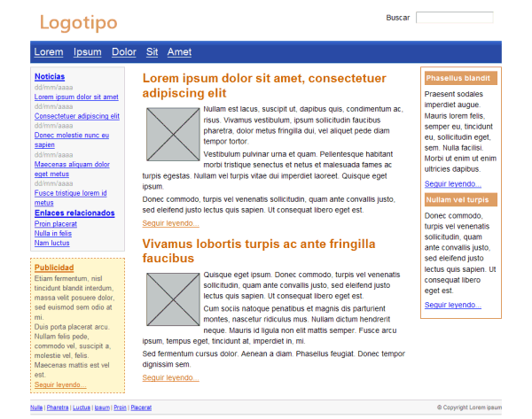
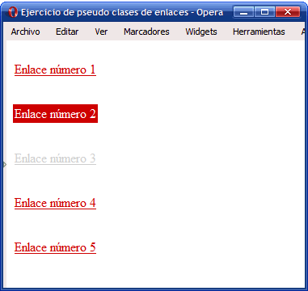

### Ejercicio 11: css. Textos y enlaces.

####Resumen

##### Texto

* *text-align*: Define la alineación del texto.
* *line-height*: Define el interlineado del texto.
* *text-decoration*: Estilo y decoración para el texto: subrayado, tachado,...
* *text-transform*: Permite mostrar el texto original transformado en un texto completamente en mayúsculas (uppercase), en minúsculas (lowercase) o con la primera letra de cada palabra en mayúscula (capitalize).
* *vertical-align*: Determina la alineación vertical.
* *text-indent*: Controla la tabulación del texto.
* *letter-spacing*: Determina la separación entre letras.
* *word-spacing*: Determina la separación entre palabras.
* *white-space*: Controla el tratamiento de los espacios en blanco.
* El pseudo-clases *:first-line* y *:first-letter*: Me permite aplicar estilo a la primera línea de un texto y a la primera letra.

##### Enlaces

* Los estilos más sencillos que se pueden aplicar a los enlaces son los que modifican su tamaño de letra, su color y la decoración del texto del enlace.
* pseudo-clases:

	* *:link*, aplica estilos a los enlaces que apuntan a páginas o recursos que aún no han sido visitados por el usuario.
    * *:visited*, aplica estilos a los enlaces que apuntan a recursos que han sido visitados anteriormente por el usuario. El historial de enlaces visitados se borra automáticamente cada cierto tiempo y el usuario también puede borrarlo manualmente.
    * *:hover*, aplica estilos al enlace sobre el que el usuario ha posicionado el puntero del ratón.
    * *:active*, aplica estilos al enlace que está pinchando el usuario. Los estilos sólo se aplican desde que el usuario pincha el botón del ratón hasta que lo suelta, por lo que suelen ser unas pocas décimas de segundo.

####Ejercicios

1. A partir del código HTML y CSS proporcionados, determinar las reglas CSS necesarias para añadir las siguientes propiedades a la tipografía de la página:

	

    1. La fuente base de la página debe ser: color negro, tipo Arial, tamaño 0.9em, interlineado 1.4.
    2. Los elementos <h2> de .articulo se muestran en color #CC6600, con un tamaño de letra de 1.6em, un interlineado de 1.2 y un margen inferior de 0.3em.
    3. Los elementos del #menu deben mostrar un margen a su derecha de 1em y los enlaces deben ser de color blanco y tamaño de letra 1.3em.
    4. El tamaño del texto de todos los contenidos de #lateral debe ser de 0.9em. La fecha de cada noticia debe ocupar el espacio de toda su línea y mostrarse en color gris claro #999. El elemento <h3> de #noticias debe mostrarse de color #003366.
    5. El texto del elemento #publicidad es de color gris oscuro #555 y todos los enlaces de color #CC6600.
    6. Los enlaces contenidos dentro de .articulo son de color #CC6600 y todos los párrafos muestran un margen superior e inferior de 0.3em.
    7. Añadir las reglas necesarias para que el contenido de #secundario se vea como en la imagen que se muestra.
    8. Añadir las reglas necesarias para que el contenido de #pie se vea como en la imagen que se muestra.

	

	* [Descargar página HTML](ej/pagina_completa.html)
	* [Descargar archivo CSS](ej/ejercicio7.css)

2. Definir las reglas CSS que permiten mostrar los enlaces con los siguientes estilos:

    1. En su estado normal, los enlaces se muestran de color rojo #CC0000.
    2. Cuando el usuario pasa su ratón sobre el enlace, se muestra con un color de fondo rojo #CC0000 y la letra de color blanco #FFF.
    3. Los enlaces visitados se muestran en color gris claro #CCC.

	

	* [Descargar página HTML](ej/ejercicio8.html)
