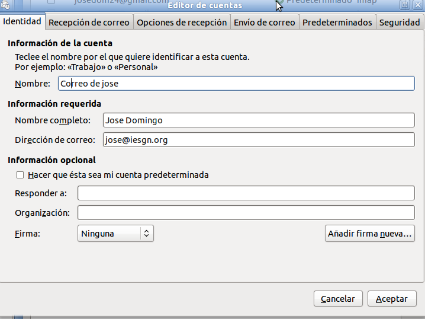
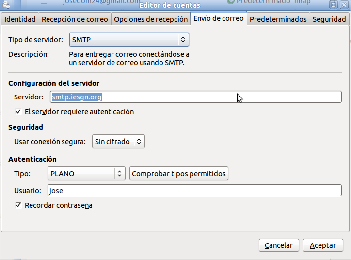

### Ejercicio: Servidor POP y configuración de cliente de correo

En informática se utiliza el Post Office Protocol (POP3, Protocolo de la oficina de correo) en clientes locales de correo para obtener los mensajes de correo electrónico almacenados en un servidor remoto.

En nuestro caso el servidor pop3 que vamos a instalar se llama dovecot-pop3, para instalarlo, simplemente:

        apt-get install dovecot-pop3d

#### Configuración del servidor de correos postfrix

Necesitamos configurar nuestro servidor de correo para permitir utilizar el servidor smtp desde otro ordenador de nuestra red local, para ello modificamos la siguiente línea en el fichero de configuración:

        mynetworks = 127.0.0.0/8 [::ffff:127.0.0.0]/104 [::1]/128 192.168.1.0/24

Ahora vamos a configurar postfix para que guarde los correos en un buzón del tipo Maildir, para ello añadimos y modificamos las siguientes directivas de configuración.

        home_mailbox = Maildir/
        mailbox_command =

Una vez realizado el cambio reiniciamos el servicio:

        service postfix reload

#### Configuración del servidor pop3

El fichero de configuración de este servicio está en /etc/dovecot/dovecot.conf, y hay que modificar las siguientes líneas (si están comentadas hay que descomentarlas):

        disable_plaintext_auth = no → para permitir la autenticación en texto plano

Reiniciamos el servicio:

        service dovecot restart

#### Configuración del cliente de correo

Es la hora de configurar un cliente de coreo desde nuestro cliente, en este ejemplo vamos a ver la configuración en evolution. Además tenemos que tener creados en el DNS de nuestro servidor los nombres pop3.iesgn.org y smtp.iesgn.org apuntando a la dirección del servidor (se pueden dar de alta usando un alias (CNAME)).

Creamos una nueva cuenta de correo con las siguientes características:

* Información de la cuenta

* Servidor POP

* Servidor SMTP

##### **Ejercicios**

Siguiendo las indicaciones dadas anteriormente, instala el servidor POP3, y configura dos clientes de correos:

* En el cliente Windows, configura el cliente de correos thunderbird con la cuenta jose@iesgn.org.
* En el cliente linux, configura el cliente de correos evolution con la cuenta maria@iesgn.org

Debes configurar el dns del servidor para que se conozcan los nombres del servidor de correo (smtp.iesgn.org) y el servidor POP (pop3.iesgn.org).

Realizas envíos de correos entre las dos usuarios.

[Volver](index)
