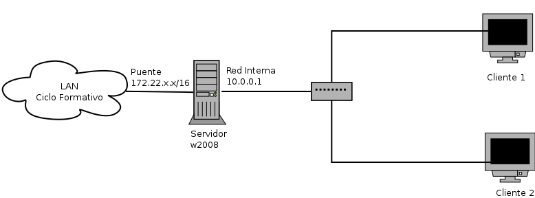

### Proyecto 1: Configuración de un servidor Windows Server

Te han contratado como administrador de redes en una empresa que posee una red de ordenadores con varios clientes y un servidor donde se ha instalado un sistema operativo Windows 2008. Actualmente la dirección de la empresa quiere mejorar la gestión de la red y ese es tu objetivo. Quieren mejorar los siguientes aspectos de la red:

* Actualmente la configuración de red de los cliente se hacía de forma estática, en un segmento de direcciones 10.0.0.0/24. Quieren tener un sistema de asignación dinámica de direcciones IP.
* Quieren crear varias páginas web para dar servicio a la intranet para ello han contratado un dominio masterlan.com
* Para poder acceder a los distintas máquinas de la intranet, se necesita que instales un servidor DNS.
* Los documentos importantes de la empresa deben ser accesible desde un servidor ftp anónimo.
* Un grupo de usuarios (los técnicos) pueden gestionar el servidor de forma remota.
* Todos los usuarios deben poseer una cuenta de correos de la forma usuario@masterlan.com

#### Esquema de red

El esquema de red que tiene la empresa es el siguiente:

Como se observa en el esquema nuestro ordenador va a tener dos tarjetas de red, por lo tanto va a ser el
responsable de gestionar la comunicación que entra y sale de nuestra red local.

La primera tarjeta está conectada a internet (en nuestro caso está conectada a la red del instituto), la segunda tarjeta está conectada a la red local y tiene el siguiente direccionamiento:

* Dirección IP: 10.0.0.1/24

#### Servidor DHCP

Los ordenadores clientes de nuestra LAN obtienen su configuración de red ofrecidas por dicho servidor, que tiene las siguientes características:

* Rango: 10.0.0.2-10.0.0.200
* Máscara de red: 255.255.255.0 
* Puerta de enlace: La ip del router
* DNS: 8.8.8.8

##### **Entrega 1**
1. Escribe una introducción donde expliques el objetivo de la práctica. El esquema real que estás desarrollando y cómo lo vas a virtualizar para poder desarrollarlo en clase. Por último indica el nombre que le has puesto al ordenador servidor. ¿Cómo has configurado ese nombre?
2. Explica la configuración de red del servidor y de los dos clientes
3. Explica la configuración del servidor para que funcione como router y nat
4. Explica la instalación y configuración del servidor DHCP.
5. Prueba de funcionamiento (Concesiones de direcciones)
6. Realiza una reserva de uno de los clientes, explica cómo lo has realizado y haz una prueba de funcionamiento.

[Volver](index)