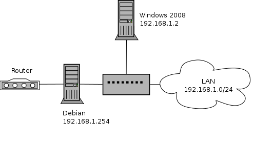

### Proyecto 2: Instalación de un servidor en un centro educativo

Un centro educativo ha comprado un servidor, en el que se va instalar una distribución Debian, y que se va a instalar siguiendo este esquema de red:

#### Enrutador

Como se observa en el esquema nuestro ordenador va a tener dos tarjetas de red, por lo tanto va a ser el responsable de gestionar la comunicación que entra y sale de nuestra red local. En una segunda fase de nuestra implantación (esto se estudiará en la asignatura de seguridad) se implantará un cortafuego en este equipo. Lo que tenemos que configurar este equipo para que enrute y haga la función de NAT.

#### Servidor DHCP

Los ordenadores clientes de nuestra LAN obtienen su configuración de red ofrecidas por dicho servidor, que tiene las siguientes características:

* Rango: 192.168.1.3-192.168.1.253
* Máscara de red: 255.255.255.0 
* Puerta de enlace: La ip del servidor
* Nombre de dominio
* DNS: 192.168.2.2

Vamos a suponer que el cliente linux es un ordenador del equipo directivo que debe tener la dirección ip 192.168.1.200. Configura una reserva en el servidor dhcp.

##### **DHCP**
1. Empieza con una introducción, donde se explique el objetivo del proyecto que vas a realizar y a continuación inserta un "Seguir leyendo..."
2. Tienes que pensar un nombre para el instituto, y a partir de ese nombre piensa un nombre de dominio que suponemos que ha comprado el centro.
3. Configura de forma adecuada el nombre del servidor totalmente cualificado. Ejecute la instrucción hostname -f
4. Explica la instalación y configuración del servidor dhcp
5. Prueba de funcionamiento (Concesiones de direcciones)
6. Prueba de funcionamiento de la reserva

[Volver](index)
