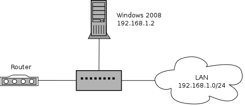

#Proyecto 1: Instalación de un servidor en un centro educativo
Nos han contratado para instalar y configurar un servidor que de servicio a un centro educativo. En la actualidad poseen un servidor ofreciendo algunos servicios, pero es necesario hacer una migración para poder ofrecer más servicios.

##1. Esquema de red actual

Como podemos ver en el esquema de red, en la actualidad dentro de nuetra red local tenemos instalado un servidor implantando con Windows Server 2008 que ofrece los siguientes servicios.

###a) Servidor DHCP

Los ordenadores clientes de nuestra LAN obtienen su configuración de red ofrecidas por dicho servidor, que tiene las siguientes características:

* Rango: 192.168.1.3-192.168.1.254
* Máscara de red: 255.255.255.0 
* Puerta de enlace: La ip del router
* DNS: Según el que te convenga para hacer las pruebas 

###b) Servidor DNS

Lo primero que tienes que hacer es determinar el nombre de dominio (puede ser el nombre del insitituo, inventatelo) que va a ser utilizado en nuestro sistema. (En esta documentación voy a utilizar el nombre example.com). El servidor DNS ofrece el servicio de resolución de nombres para los ordenadores de nuestra red local. Debes tener en cunta los siguientes puntos:

* Cuando tengas funcionando el servidor DNS, tendrás que modificar el servidor DHCP para que los clientes usen el servidor DNS. 
* Piensa el nombre que tiene el servidor. El servidor DNS debe poder resolver los siguientes nombres: nombredelservidor.example.com, www.example.com, informatica.example.com El primero es el nombre del servidor, los dos siguientes son dos páginas webs que el servidor va a servir. 
* Debes implementar la zona inversa del servidor.

###c) Servidor WEB

El servidor tiene instalado un servidor Web IIS, que sirve dos virtual host con páginas web estáticas.

* www.example.com: Página principal del centro.
* informatica.example.com: Página del departamento de informatica
* La página www.example.com, posee un directorio /privado, que para acceder a el es necesario autentificarse.

Deficiencias que nos encontramos con este esquema

1. El servidor es un ordenador más de nuestra LAN, por lo que el cortafuegos que podemos configurar se debería implantar en el router.
2. Igualmente el dispositivo que hace NAT es el router, que puede ser insuficientes para muchos ordenadores. 
3. No se controla de ninguna manera la navegación de los clientes. 
4. El servidor web actualmente instalado solo ofrece página html estáticas. 
5. Algunos servicios que faltan: web dinámica, servicio de ftp, servicio de correos, proxy,...

##2. Especificación del nuevo esquema de red

El centro educativo ha comprado un servidor, en el que se va instalar una distribución Debian Wheezy, y que se va a instalr siguiendo este esquema de red:

Aunque vamos a mantener el servidor Windows 2008 dentro de nuestra red local, vamos a sustituyendo los distintos servicios que ofrece. Se mantiene por que suponemos que ofrece un servicio de directorio activo que no vamos a sustituir.

###a) Enrutador

Como se observa en el esquema nuestro ordenador va a tener dos tarjetas de red, por lo tanto va a ser el responsable de gestionar la comunicación que entra y sale de nuestra red local. En una segunda fase de nuestra implantación (esto se estudiará en la asignatura de seguridad) se implantará un cortafuego en este equipo. Lo que tenemos que configurar este equipo para que enrute y haga la función de NAT.

###b) Servidor DHCP

Debes instalar un servidor DHCP en este ordenador. Para probarlo sin ningún problema debes parar el servidor DHCP del Windows 2008. Debe tener las siguientes características:

* Rango: 192.168.1.3-192.168.1.253
* Máscara de red: 255.255.255.0 
* DNS: Mientras no tengas instalado un servidor DNS, puedes usar el del Windows 2008.

###c) Servidor Web
